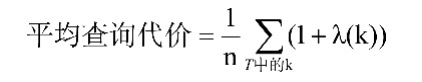
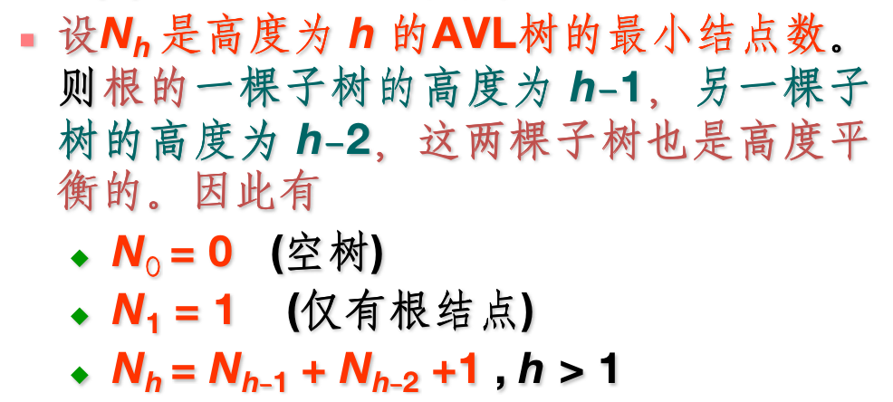
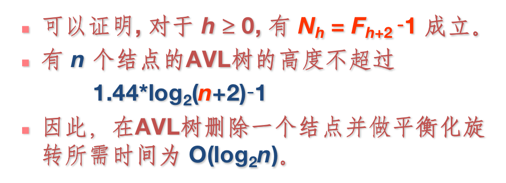

## 搜索与索引

- `搜索`：搜索操作的实施方法和计算复杂性**同数据的存储结构**有很大的关系，总体讲数据的存储结构和操作方式可以有如下两种分类方式：

  - 静态和动态
    - 静态不考虑插入和删除
    - 动态要考虑插入和删除、查找的算法以及效率
  - 内存和外存
    - 整个数据结构完全放在内存中
    - 数据部分或全部存放在次盘上，为此在搜索和数据组织中需要充分考虑磁盘的读写特点

- `索引`：是用于支持搜索操作的数据结构及其操作，其目标是==提高搜索操作的性能==。目前索引被认为是提升大规模数据查询和检索操作性能的最有效的手段之一。

  - 设计一个索引结构的过程中需要从如下方面进行的考虑
    - 大规模数据
    - 高校地搜索
    - 频繁地插入、删除和修改操作
    - 考虑数据存储介质的特点（例如在以磁盘为存储介质的索引结构应该考虑磁盘是按块存取的）
    - 有效地支持数据结构本身的特点

- `顺序表vs链表`

  - 它们同属于[线性表](http://data.biancheng.net/view/157.html)，但数据的存储结构有本质的不同：

    - 空间上的比较（Space）

      - a. 空间的开辟：

        - 顺序表的实现一般是连续开辟一段空间，固定空间大小

          > 但是动态顺序表也可以在初始化时利用malloc函数来开辟一块空间，每当空间不够用时，再用realloc来把当前空间扩容成2倍，从而也能实现空间的动态变化

        - 单链表一次只开辟一个结点的空间，动态空间大小的

      - b. 空间的使用：

        - 顺序表：若未确定要存储多少数据，用开辟的空间太大，会造成一定程度上的浪费
        - 单链表：
          - 每个节点都会有非数据项的指针，因此会造成空间的浪费
          - 若每次开辟的位置是随机的，会产生碎片空间

      - c. 对CPU高速缓存的影响：

        - 顺序表：由于空间是连续开辟的，并且一次会开辟存储多个元素的空间，所以在使用顺序表时，可以一次把多个数据写入高速缓存，再写入主存。因此CPU高速缓存效率更高，CPU流水线不会总是被打断。
        - 单链表：每一次数据存储都需要单独的写入高速缓存区，再写入主存。因此CPU高速缓存效率较低，CPU流水线会总是被打断。

    - 时间上的比较

      - a. 访问随机元素的时间复杂度：
        - 顺序表：O(1)
        - 单链表：O(n)
      - b. 随机位置插入、删除元素的时间复杂度：
        - 单链表：O(1)
        - 顺序表：O(n)

- 在有序的顺序表上搜索：二分、插值、斐波那契搜索

- `二叉搜索树`

  - 平均查询代价

    对于成功的查找，从n个结点的二叉搜索树T中找出结点k所需的比较次数，是从根结点到结点k的树枝长度λ(k)加1，因此可以得到

    - 搜索的最大代价=max{1十λ(k)|树T中的所有结点k}

    - 搜索的平均代价=Σp(k)(1+λ(k))

      > 其中P(k)是结点k被搜索概率。如果所有结点被搜索的概率都相等，那么对树T中的任一结点k都有p(k)=1/n。此时，有
      >
      > 显然，当树中结点尽量靠近树根时，平均查询代价最小；而当查找树退化成链表时，平均查询代价最大。

- `最优二叉搜索树`（有缘再复习）

- `AVL树`

  - 保证树的深度是O(logN)

  - 性能分析

    > 设在新结点插入前AVL树的高度为 h，结点个数为 n，则插入一个新结点的时间是O(h)。对于AVL树来说，h 多大？
    >
    > 
    >
    > 

