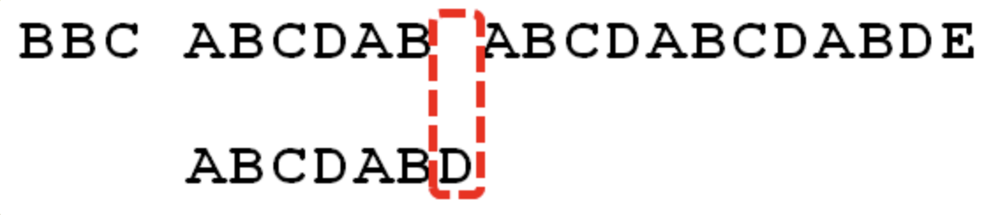
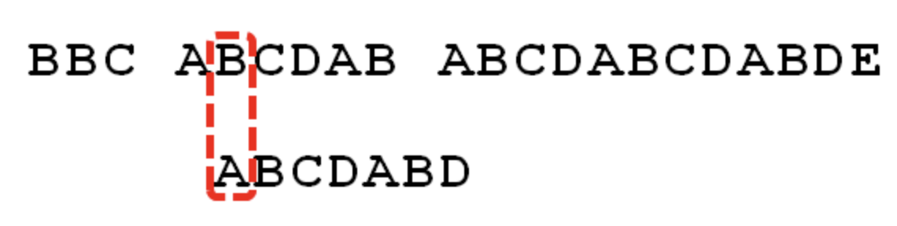
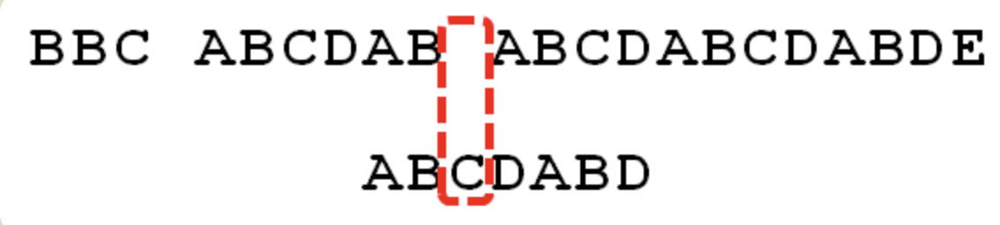
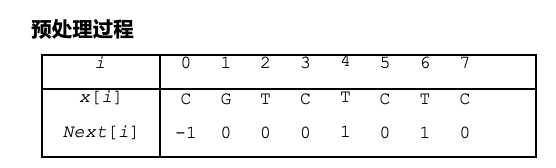
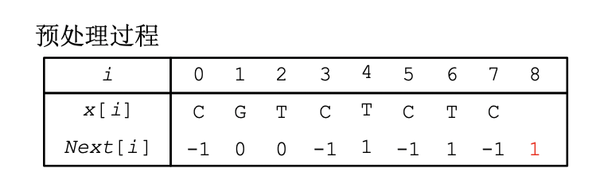
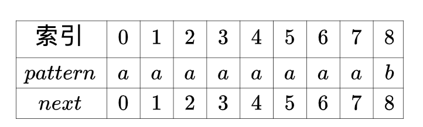

## 字符串

### KMP算法——在长串中匹配特定短串的位置

- 解决问题：在长串中查找短串的一个、多个或所有出现的问题
- 关键概念：长串为text（长度为n），短串为pattern（长度为m）

#### BF算法

- 算法复杂性：O(m*n)

- 最大匹配次数：(n-m+1)*n
- 特点：
  - 不需要预处理
  - 比对可按任意顺序进行
  - 回溯，会出现重复读取的现象

#### KR（Karp-Rabin）算法

将滑动窗口内m个字符的比较变为一个哈希值的比较

- 算法复杂性：取决于**哈希函数**的选取

  > 通常选取h(x) = x mod q，其中q为大整数，需要预处理

  - 最坏情况：O(m*n) 【所有hash值相同，但是字符串不同】
  - 预期：O(m+n)【之前的hash值都不同】

- 预处理需要O(m)的时间和常数的存储空间

#### KMP(Knuth-Morris-Pratt)算法

[KMP算法原理]([http://www.ruanyifeng.com/blog/2013/05/Knuth%E2%80%93Morris%E2%80%93Pratt_algorithm.html](http://www.ruanyifeng.com/blog/2013/05/Knuth–Morris–Pratt_algorithm.html))

假设：

- Text：BBC ABCDAB ABCDABCDABDE
- Pattern：ABCDABD

##### 1. 部分匹配表

| 搜索词     | A    | B    | C    | D    | A    | B    | D    |
| ---------- | ---- | ---- | ---- | ---- | ---- | ---- | ---- |
| 部分匹配值 | 0    | 0    | 0    | 0    | 1    | 2    | 0    |

部分匹配值就是**前缀和后缀的共有元素**的长度

```ps
　　－　"A"的前缀和后缀都为空集，共有元素的长度为0；

　　－　"AB"的前缀为[A]，后缀为[B]，共有元素的长度为0；

　　－　"ABC"的前缀为[A, AB]，后缀为[BC, C]，共有元素的长度0；

　　－　"ABCD"的前缀为[A, AB, ABC]，后缀为[BCD, CD, D]，共有元素的长度为0；

　　－　"ABCDA"的前缀为[A, AB, ABC, ABCD]，后缀为[BCDA, CDA, DA, A]，共有元素为"A"，长度为1；

　　－　"ABCDAB"的前缀为[A, AB, ABC, ABCD, ABCDA]，后缀为[BCDAB, CDAB, DAB, AB, B]，共有元素为"AB"，长度为2；

　　－　"ABCDABD"的前缀为[A, AB, ABC, ABCD, ABCDA, ABCDAB]，后缀为[BCDABD, CDABD, DABD, ABD, BD, D]，共有元素的长度为0。
```

##### 2. 匹配规则



按照BF，会变为：



按照KMP，查询最后一个匹配位B对应的匹配值为2（意味着可以少移动2位）。因此，**移动位数=已匹配的字符数-对应匹**

**配数**。此处为6-2=4。变为：



##### 3. 教材版本

教材版本中，采用的是Next数组



以T为例，Next[4]=1的意思是，若匹配到这个T不同，只用再去匹配G是否相同就可以了，前面那位C无需匹配

对Next数组进行优化：



```c++
int kmp(string S,string T){
    int i=0,j=0;
    while(i<S.size()&&j<T.size()){
        if(j==-1||S[i]==T[j]){ //j==-1的意义是保持从第一位开始匹配
            i++;
            j++;
        }
        else j=next[j];
    }
    if(j != -1 && j>=T.size()) return i-T.size(); //返回匹配最开始的位置
    else return 0;
}

// Next[0] = -1
void pre(string S,int Next[]){
    int i=0,j=-1;
    while(i<S.size()){
        if(j==-1||S[i]==S[j]){
            i++;
            j++;
            if(S[i]==S[j]) Next[i]=Next[j]; //这一步是优化
            else Next[i]=j;
        }
        else j=Next[j];
    }

}
```

##### 3. 算法复杂性

[KMP算法详解](https://zhuanlan.zhihu.com/p/108982607)

KMP算法的最差情况：




每次都在pattern的最后一个字符失配，产生9次回退。【这里应该是没有优化过的next】next在推进的时候，x也在推进，因此就算next回退，总的回退次数也不会超过n。因此最多比较次数不会超过2n-1次

- 最多比较：==2n-1次==，因此时间复杂度为O(n)
- 构建next数组需要O(m)
- 总的时间复杂度为O(m+n)

### Manacher算法——寻找最长回文串的长度

##### [P3805 【模板】manacher算法](https://www.luogu.com.cn/problem/P3805)

##### 最主要的变量：

- pos：右侧最远的回文串的对称中心

- maxr：右侧最远的回文串的最右边界

- p数组：p[i]代表以i为中心的最长回文串长度

- s_new数组：以s = "abbahopxp"为例，转化为：

  ==注意：a之前也要插入#，否则答案不正确==

  

  插入#以防止奇偶判断，插入$以防止边界判断（只要判断s_new不同，则终止扩展）

##### 最主要的思想：

- 回文对称中心为pos，因此以i为中心的回文子串关于pos对称也有以j为中心的回文子串，两个回文子串（黄色部分完全相等）。

  

- 因此可以用已经遍历过的j来帮助判断p[i]

  ``` c++
  if(i < maxr)	p[i] = min(p[2*pos-i],maxr-i)
  ```

  这里需要判断i<maxr是因为，我们只知道pos的回文边界（maxl,maxr）以内的信息，如果超过这个边界，先默认：

  ```c++
  else	p[i] = 1
  ```

  此处取min是因为，我们只知道pos的回文边界（maxl,maxr）以内的信息，如果超过了该边界，需要另作判断。如果相似，则可以拓展p[i];

  ```c++
  while(s_new[i-p[i]]==s_new[i+p[i]]){
  	p[i]++;
  }
  ```

- 用i+p[i]不断扩展maxr，一旦i+p[i]超过maxi，则可以更新maxr以及pos的位置

  ```c++
  if(maxr < i+p[i]){
  	pos = i;
  	mx = pos + p[i];
  }
  ```

- 在整个过程中，记录下最长的回文长度

  ```c++
  if (p[i] - 1 > ans)	ans = p[i] - 1;
  ```

##### 时间复杂度分析：

这个过程中，没有重复判断相同的字符串，一直都是往前推进maxr，因此时间复杂度是O(n)

### Trie树——快速查询多个单词的每一个部分

主要思想就是把所有单词都生成在一个树上，如果要判断每个单词来自哪个文章，就用一个b[单词编号]\[文章编号]来记录。所谓的单词编号就是给每一个节点一个编号。


==注意==：Trie树的根节点为空，单词末尾有个特殊标记（$）

最基本的操作：

- insert插入：

  - b[]\[]：第一维度——整棵树每个节点的编号（相当于该单词）；第二维——第j篇文章；如果值为1，代表这篇文章出现了这个单词
  - nex[]\[]：第一维度——整棵树每个节点的编号（相当于该单词）；第二维：0~25的数字，对应26个字母
  - now：代表现在所处的层数

  ```c++
  void insert(int x){
  	//x代表第x篇文章
  	string s;
  	cin >> s;
  	for(int i=0;i<s.size();i++){
  		int p = s[i] - 'a';
  		if(!nex[now][p])	nex[now][p] = ++cnt;
  		now = nex[now][p]
  	}
  	b[now][x] = 1
  }
  ```

  ==trie树的实现也可以用struct包装起来，也可以像现在一样用多个数组来记录相关信息。但是注意如果struct中数组太大会报错。==

- check查询：

  - 顺着树根，dfs下去，找到以后，只要b[now]\[j]为1，则代表第j篇文章有该单词

  ```c++
  void check(){
  	string s;
  	cin >> s;
  	int now=0,flag = 1;
  	for(int i=0;i<s.size();i++){
  		int p = s[i] - 'a';
  		if(!nex[now][p]){
  			flag = 0;
  			break;
  		}
  		now = nex[now][p];
  	}
  	if(flag == 1){
  		for(int i=0;i<n;i++){
  			if(b[now][i])	cout << i+1 << " ";
  		}
  	}
    cout << endl;
  }
  ```

### AC自动机——KMP升级版，匹配多个模式串以及一个文本串

主要的思想是把Next数组搬到Trie树上。Next数组总是在找**最大匹配后缀**，因此AC自动机也是在找最大匹配后缀，不过此时的后缀是树的另一条分支罢了。


可见，5\~7是1\~4的最大匹配后缀，因此利用fail数组指向它。


如果没有最大匹配后缀（比如第一层），就指向根节点


#### 所需变量

```c++
struct luogu{
	int son[26]; //子节点，存储的值是唯一的编号
	int cnt,fail; //cnt：这个单词出现的次数；fail：最大匹配后缀
}trie[500010];
```

初始化trie树

```c++
int tot;
void insert(string s){
	int now = 0;
	for(int i=0;i<s.size();i++){
		int p = s[i] - 'a';
		if(!trie[now].son[p])	trie[now].son[p] = ++tot;
		now = trie[now].son[p];
	}
	trie[now].cnt++;
}
```

#### 如何构建fail数组

对于每个节点A，遍历26个字母：

- 如果该字母有子节点，该子节点的fail边指向 = A的fail边指向节点 的 子节点
- 如果该字母没有子节点，该子节点 = A的fail边指向节点 的 子节点

总之要使整个查询延续下去。由于是层次遍历，需要借助queue：

```c++
void getfail(){
	queue<int> q;
	//初始化第一层
	for(int i=0;i<26;i++){
		int p = trie[0].son[i];
		if(p){
			trie[p].fail = 0;
			q.push(p);
		}
	}
	
	//利用bfs构建fail
	while(!q.empty()){
		int u = q.front();
		q.pop();
		int f = trie[u].fail;
		for(int i=0;i<26;i++){
			int p = trie[u].son[i];
			if(p){
				trie[p].fail = trie[f].son[i];
				q.push(p);
			}else	trie[u].son[i] = trie[f].son[i];
		}
	}
}
```


#### 如何匹配

先不断走fail边（都是指向相同的字符），走到尽头时，退出循环，继续走子节点。

只有走到最后才有cnt，因此每次加入的cnt值就代表这个模式串在待匹配串中出现过；每次匹配后，要将cnt置为-1，代表不再匹配。

```c++
int find(string s){
  int now = 0;
  int sum = 0;
  for(int i=0;i<s.size();i++){
    int tmp = trie[now].son[s[i] - 'a'];
    //一个字符，多次匹配
    while(tmp && trie[tmp].cnt!=-1){
      sum += trie[tmp].cnt;
      trie[tmp].cnt = -1;
      tmp = trie[tmp].fail;
    }
    //匹配完回到儿子节点，继续匹配下一个字符
    now = trie[now][s[i] - 'a'];
  }
  return sum;
}
```

### 回文自动机

### 后缀数组

### 后缀自动机

