# 树

- `结点的次数（度）`：一个结点的子树个数。

  - `树的次数（度)`：树中各结点次数的==最大值==。
  - `m次完全树`：树T中非叶子结点的次数都为m。

- 树的存储结构

  - 子女链表表示法：把一个结点用两个部分表示，数据部分存放结点的数据（关键字），指针部分存放指向==子结点==的指针
  - 双亲表示法：每个结点同样由两个部分构成，第一个部分仍然是数据，第二个部分也是指针，但指向==双亲结点==。
  - 子女兄弟链表表示法
  - 广义表表示：k0(k1(k2,k3),k4,k5(k6(k7)))

- 树的线性表示

  - 树的层号表示
    - 如果k’是k的子结点，那么lev(k’) >lev(k)；
      如果k’和k’’都是k的子结点，那么lev(k’) =lev(k’’)；
      层号与结点所在的层次含义不同，==结点的层次是唯一的==，而结点的层号则不然，只要满足层号的上述两个条件的整数都可以作为结点的层号。
  - 树的括号表示（广义表表示）
    - k0(k1(k2,k3),k4,k5(k6(k7)))

- 树的遍历

  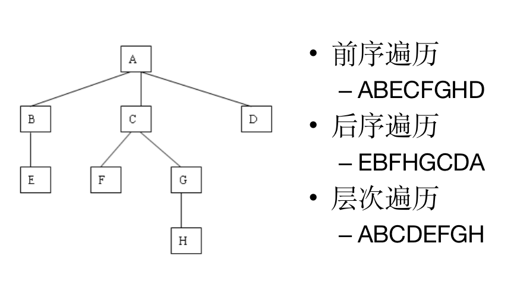

  > 时间复杂度分析：
  >
  > - 递归遍历：
  >   - 每个节点遍历一次，时间复杂度——O(n)；
  >   - 最差情况下递归调用的深度为O(n)，因此空间复杂度——O(n);
  > - 非递归遍历：借助栈
  >   - 每个节点遍历一次，时间复杂度——O(n)；
  >   - 空间复杂度——二叉树的高度O(n)

- 二叉树

  - 相关计算

    - 如果从0开始计数二叉树的层次, 则在第 i 层最多有 2i 个结点。(i ≥ 0)。
    - 高度为 h 的二叉树最多有 $2^{h+1}-1$个结点，(h ≥ 0)，最少有h+1个结点。
    - 任意一棵二叉树, 如果其==叶结点==有 n0 个, ==次数为2的非叶结点==有 n2 个,   则有 ` n0＝n2＋1`

  - `满二叉树`：一类特殊的二叉树，在满二叉树中，每一层结点数目都达到了最大。因此，高度为k的满二叉树就有$2^{h+1}-1$个结点。

  - `完全二叉树`：==除最后一层外==，其它各层的结点个数都达到最大，最后一层则从右向左连续缺0或者多个结点，这就是完全二叉树(Complete Binary Tree)。

    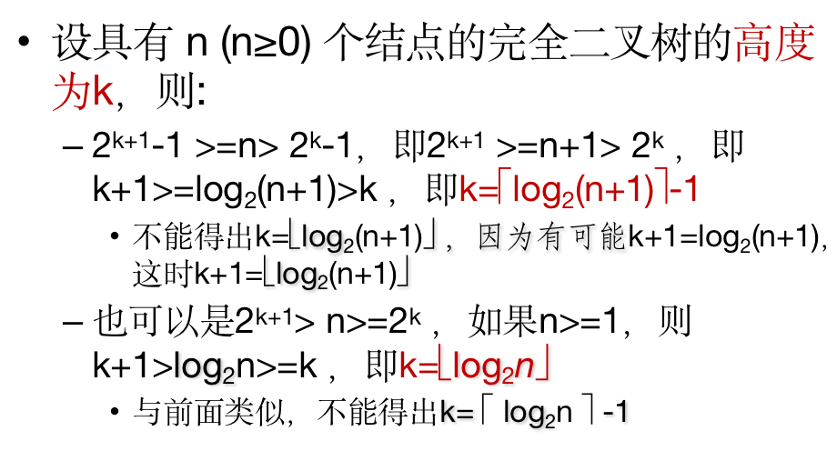

    

  - 把任意次树转换成相应的二叉树的方法——`左孩子右兄弟法`

    > 左儿子右兄弟，顾名思义，是一棵转换后的树，它是一棵二叉树，一个节点的==左子树表示的是原树中这个节点的子节点==，一个节点的右子树表示的是这个节点在==原树中的兄弟==(父节点相同的点)。

    - 树的==先根遍历顺序==与对应二叉树的==前序遍历==顺序相同。

    - 树的==后根遍历顺序==与对应二叉树的==中序遍历==顺序相同。

      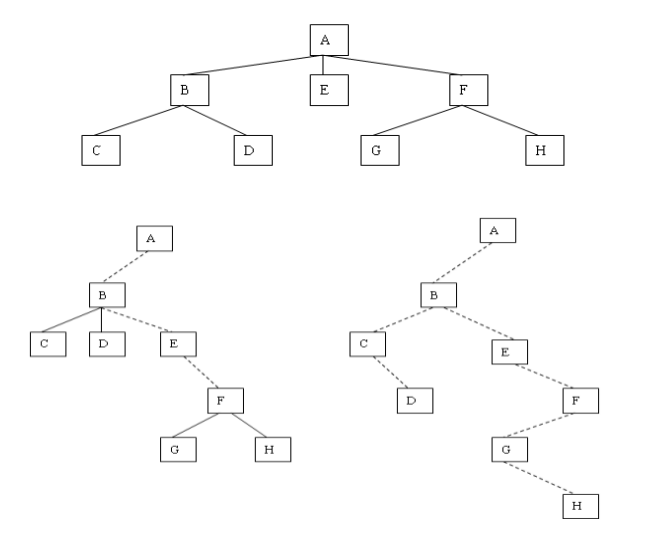
    
  - 二叉树的存储表示
  
    - 链表：
  
      - 二叉链表：每个结点包含3个域，一个用于存放结点本身的数据，一个用于存放指向左子结点的指针，一个用于存放指向右子结点的指针。
      - 三叉链表：为每个结点增加一个指向双亲结点的指针
  
    - 数组：
  
      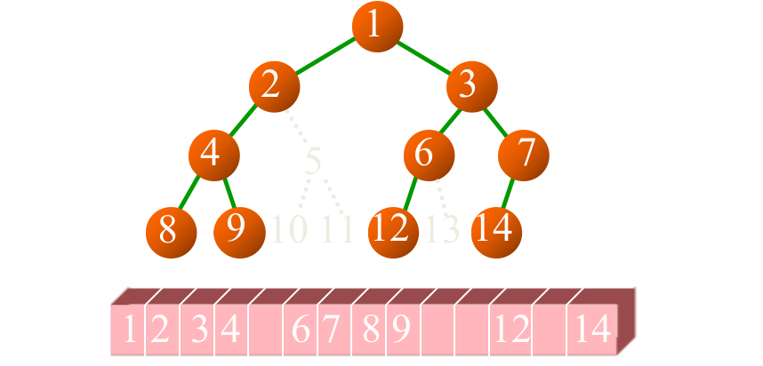
  
    - 对比：
  
      - 链表：可存放在任何存储单元中。这为经常要删除和插入结点的树提供了方便。
      - 数组：把二叉树中的结点按某种“适当的次序”依次存放在一组连续的存储单元中，使得结点的这种次序能反映树结构的信息。
        - 可能会有较多的空间浪费。
        - 删除或者添加树上的结点的时候，被删除或者添加的结点的子结点的层次会发生变化，需要大量移动数组中的元素
  
  - 二叉树的遍历
  
    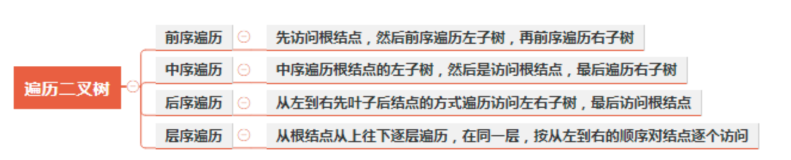
    
  - 线索树
  
    - `中序线索树`：树中保存部分原来栈中的信息
  
      - no二叉指针：如果按二叉指针形式来存储，那么总共有2n个指针，其中只有(n-1)个用来指向子结点，另外（n+1）个指针是空的
      - 前驱后继：当k的左指针指向前驱（或后继）时，k的ltag为1；指向真正的子结点时，k的ltag为0
        - 只有当k是按中序的==最前（后）结点==时，k的左（右）指针才为空，同时k的ltag（rtag）取值为0。
        - （lchild，ltag，Data，rtag，rchild）
        - 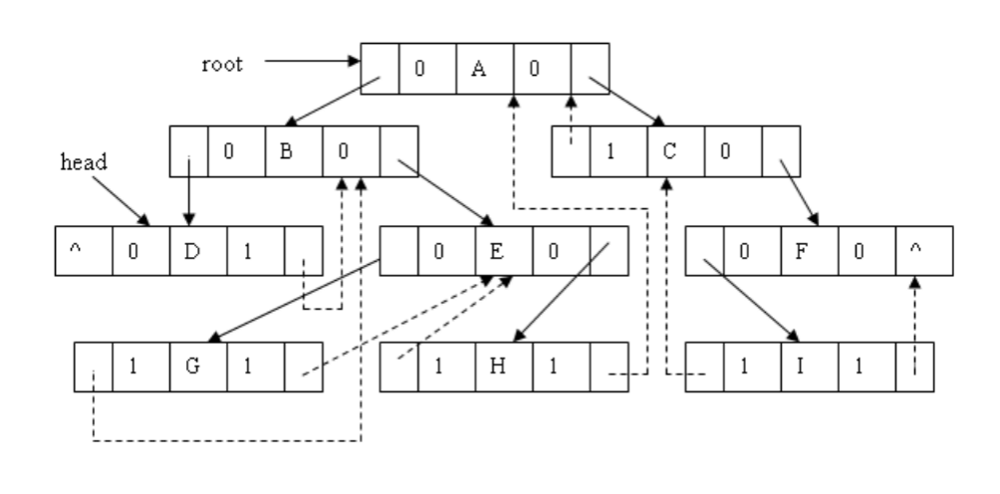
  
    - 删除节点
  
      > 以删除t的右子女r为例，分4种情况
      >
      > - r是叶子结点：r的后继s如果存在则s左孩子非空，不需调整
      >   t->rchild = r->rchild; t->rtag = r->rtag ;  //并且肯定指向的不是它
      > - r的左孩子空：要让r的右子树中序第一个结点p（原来的前驱为r）记住r的前驱（实际上就是t）
      >   node<Type> *p=first(r->rchild); p->lchild=r->lchild; t->rchild=r->rchild;
      > - r的右孩子空：要让r的左子树中序最后结点p记住r的后继
      >   node<Type> *p=last(r->lchild); p->rchild=r->rchild; t->rchild=r->lchild;
      > - r同时具有左右子树：把r的右子树接到r的左子树中序最后结点p之后，让r的右子树中序第一个结点q的左孩子指回p。 （p原来的后继是r，q原来的前驱是r）
      >   node<Type> *p = last(r->lchild); p->rchild = r->rchild; p->rtag = r->rtag; 
      >   t->rchild = r->lchild; node<Type> * q = first(r->rchild); q->lchild = p
  
      死记硬背没用，记住关键的两个点：
  
      - 分四类讨论
      - 重新确定r的前驱的后继，r的后继的前驱
      - 注意有些情况下r的后继【左孩子ltag=0且没有指向r】、前驱【本来rtag=1但是调整后rtag！=1了】是不需要大改变的
  
  - 计算二叉树的数目
  
    - 由二叉树的==前序序列和中序序列==可唯一地确定一棵二叉树。
  
      - 对二叉树的结点进行编号，使得它的前序是1，2，…，n。则具有 n 个结点的不同二叉树的数目等于具有前序为1，2，…，n的二叉树可能得到的不同中序的数目。
  
      - 也等于==固定了n个元素进栈顺序后不同的出栈顺序==的数目
  
      - `Catalan函数`：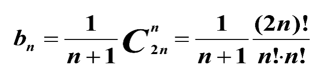
  
      - 二叉树的路径长度：
  
        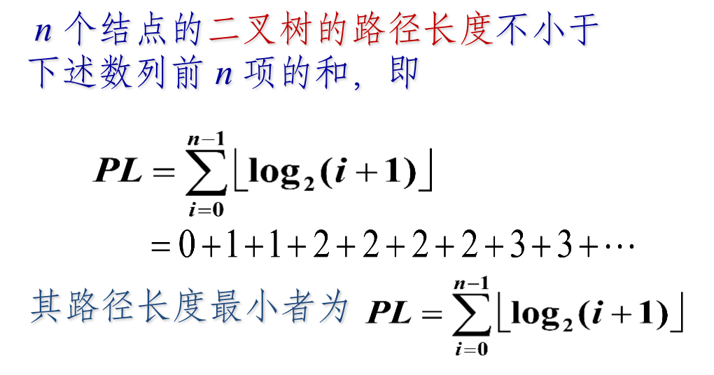
  
  - Huffman树
  
    - 
    - 
    - 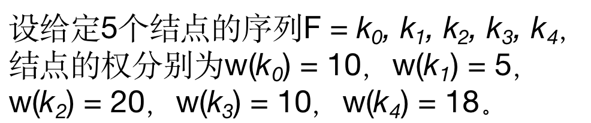
    - 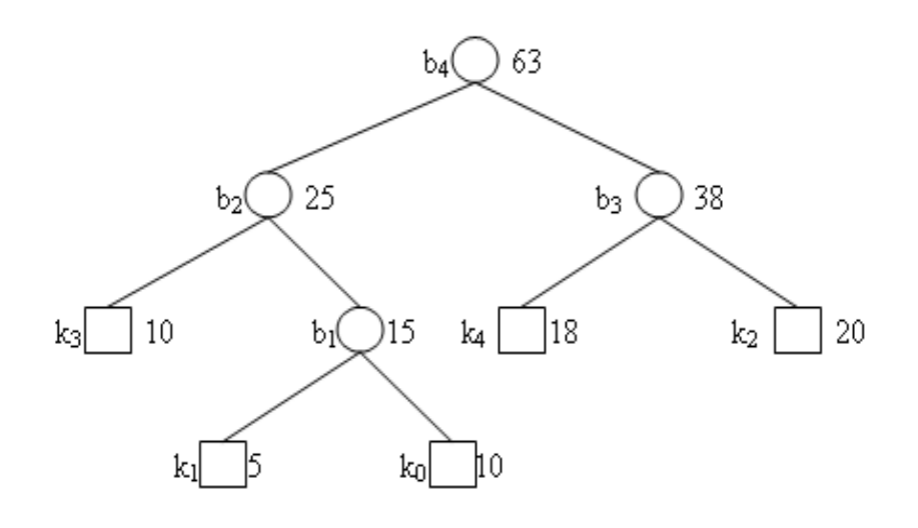
    - 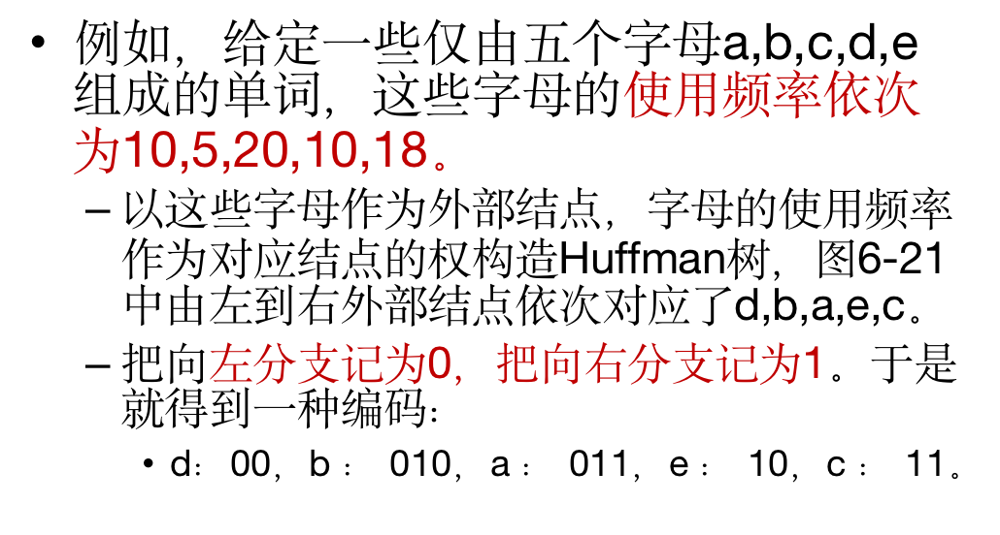
    - 

- 满二叉树(full binary tree)和完美二叉树(perfect binary tree)

  - **2.3 完美二叉树(Perfect Binary Tree)**：完美二叉树：全满

    

  - **2.4 完全二叉树(Complete Binary Tree)**：从根结点到倒数第二层满足完美二叉树，最后一层可以不完全填充，其叶子结点都靠左对齐。
  
    
  
  - **2.5 满二叉树(Full Binary Tree)**：任意节点的子节点数目只有 0 和 2 两种可能。
  
    
  
    

